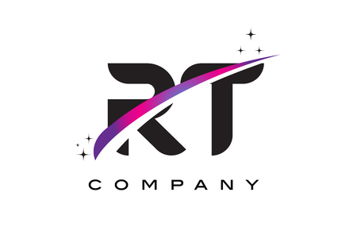

<!-- PROJECT LOGO -->
<br />
<div align="center">
    
  </a>

  <h3 align="center">R-TYPE</h3>

</div>

㆓㆓㆓㆓㆓㆓㆓㆓㆓㆓㆓㆓㆓㆓㆓㆓㆓㆓㆓㆓㆓㆓㆓㆓㆓㆓㆓㆓㆓㆓㆓㆓㆓㆓㆓㆓㆓㆓㆓㆓㆓㆓㆓㆓㆓㆓㆓㆓㆓㆓㆓

The aim of this project is to re-create the famous RType arcade game in C++ and implement client-server architecture with multi-player mode. A modular game engine was to be developed, with content creation tools. Possibility of a single-player mode with AI. The project imposes professional rigor in both the design and writing of the code, and the optimization of client-server communication. The game's performance is up to the highest standards.
――――――――――――――――――――――――――――――――――――――――――――――――――
<h3 align="center">Built With</h3>


* 
* 

<p align="right">(<a href="#R-TYPE">back to top</a>)</p>
――――――――――――――――――――――――――――――――――――――――――――――――――
 <h3 align="center">Compability</h3>

* 
* 
* 

――――――――――――――――――――――――――――――――――――――――――――――――――

 <h3 align="center">Requirements</h3>


――――――――――――――――――――――――――――――――――――――――――――――――――


 <h3 align="center">Getting Started</h3>

To launch the game, just follow these instructions :smile:

> ÉTAPE 1
```sh

```

> ÉTAPE 2
```sh

```

> ÉTAPE 3
```sh

```

――――――――――――――――――――――――――――――――――――――――――――――――――

<p align="right">(<a href="#R-TYPE">back to top</a>)</p>


<!-- TEAM -->


## 🇫🇷 Crew & Organization
╚═════╝

| Roles | Name |
| ------ | ------ |
| Project Leader & Engineer  | Maori Dino |
| AI Engineer |  Mohamed Mansour |
| Network Engineer | Yanis Denat |
| Network & Game Engineer | Thibault Tran |
| Game Engineer | Raphael de Monchy |

  
<p align="right">(<a href="#R-TYPE">back to top</a>)</p>


<!-- LICENSE -->
## License

Distributed under the MIT License. See `LICENSE.txt` for more information.

<p align="right">(<a href="#R-TYPE">back to top</a>)</p>


